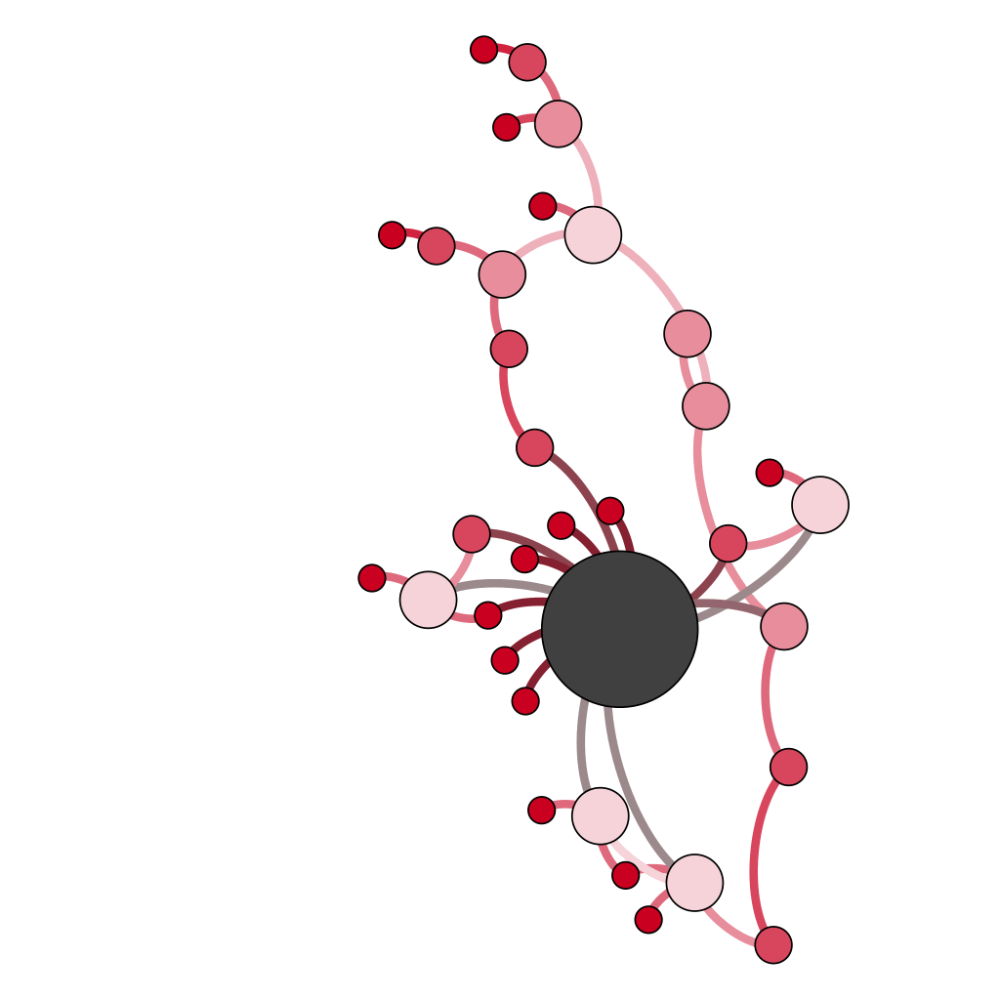

# TextNet

TextNet provides various scripts to produce textual networks. If you use this code for academic purposes, please cite the following paper: 

```
@article {Karsdorp160071,
  author = {Karsdorp, Folgert and van den Bosch, Antal},
  title = {The structure and evolution of story networks},
  volume = {3},
  number = {6},
  year = {2016},
  doi = {10.1098/rsos.160071},
  publisher = {The Royal Society},
  URL = {http://rsos.royalsocietypublishing.org/content/3/6/160071},
  eprint = {http://rsos.royalsocietypublishing.org/content/3/6/160071.full.pdf},
  journal = {Royal Society Open Science}
}
```   


